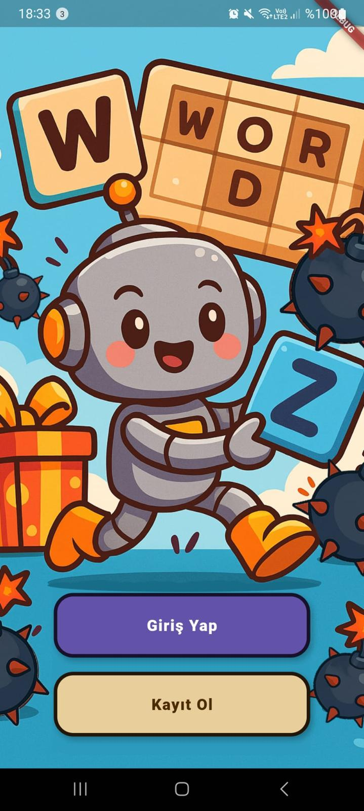
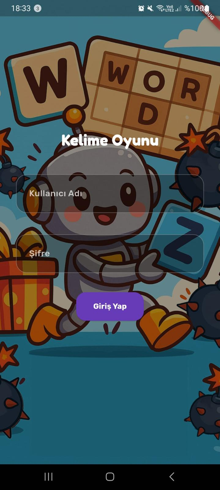
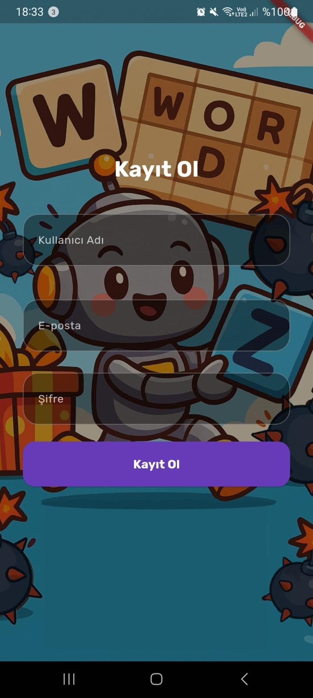
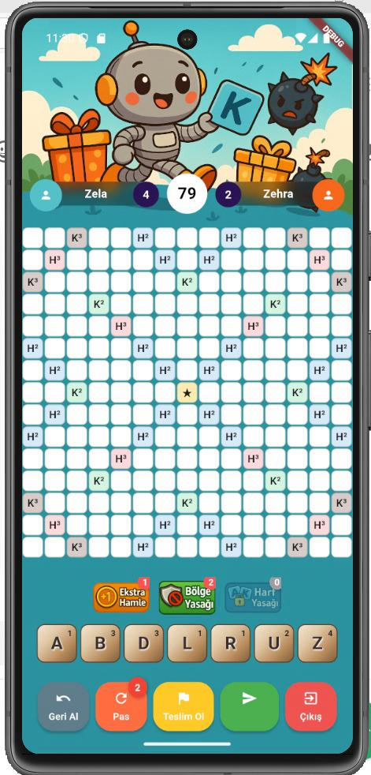
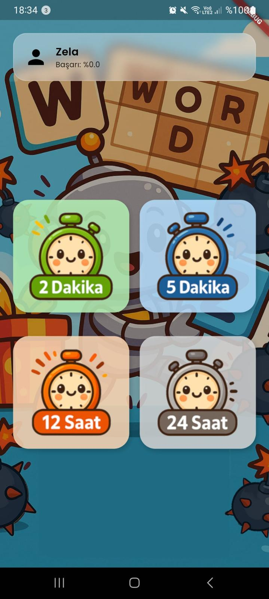
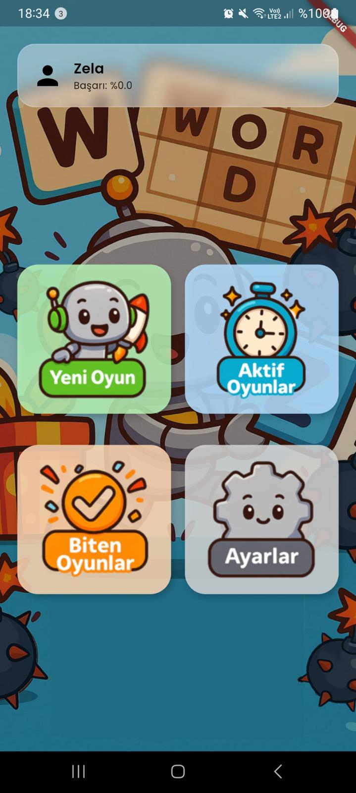
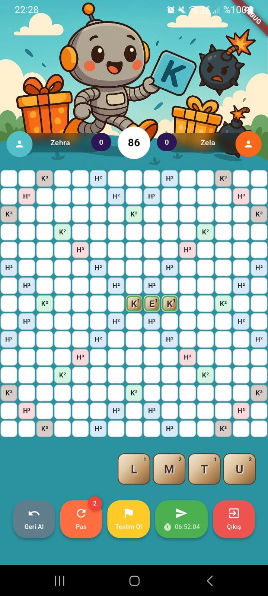
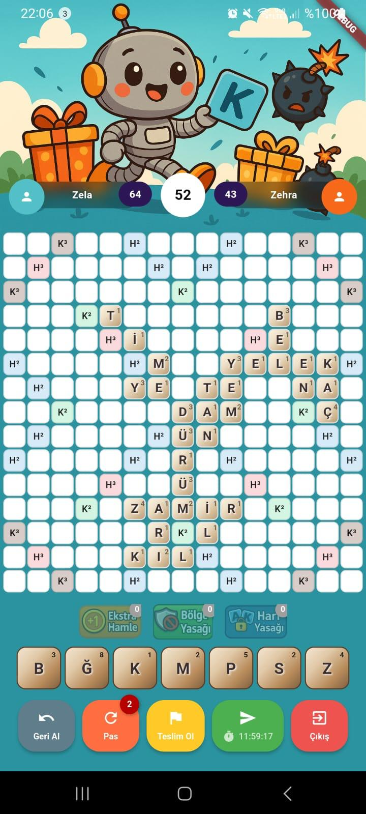
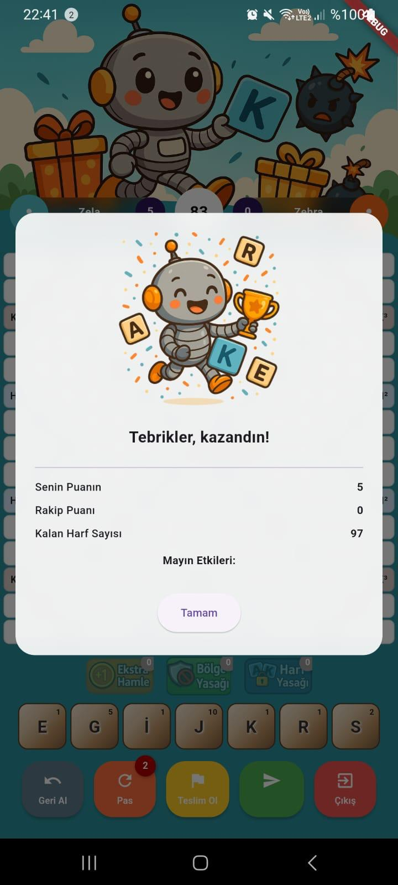
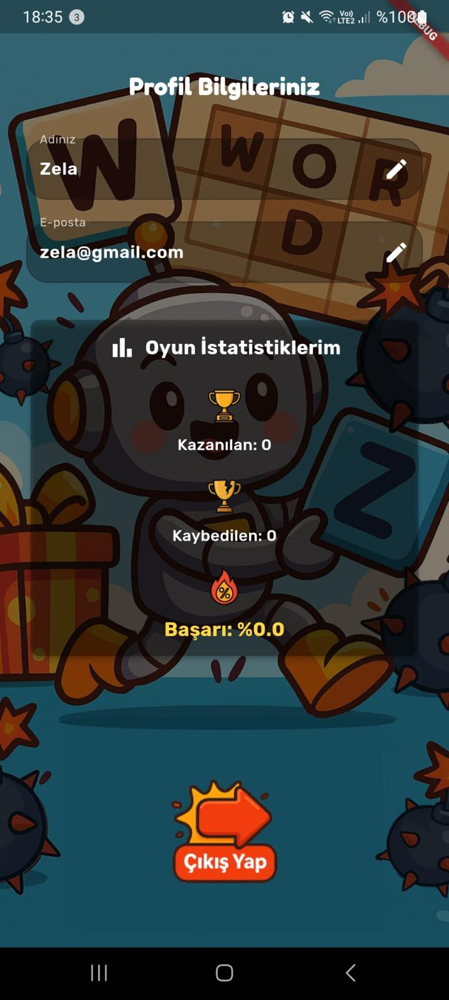

# 💣 Kelime Mayınları - Real-Time Multiplayer Word Game

Bu proje, 15x15 boyutunda bir oyun tahtasında harfleri sürükleyip bırakarak kelime üretme üzerine kurulu, stratejik mayın ve ödül hücreleri içeren gerçek zamanlı bir mobil Türkçe kelime oyunudur.

---

## 🌟 Öne Çıkan Özellikler

* **Gerçek Zamanlı Etkileşim:** SignalR teknolojisi kullanılarak oyuncular arasında anlık eşleşme, hamle iletimi ve oyun durumu senkronizasyonu sağlanır.
* **Stratejik Hücreler:** Oyun tahtası; puan artıran ödül hücreleri ve oyunun gidişatını değiştiren gizli mayınlar (puan sıfırlama, harf kaybı, puan transferi vb.) içerir.
* **Esnek Zaman Yönetimi:** Oyuncular tercihlerine göre 2 dk, 5 dk, 12 saat veya 24 saatlik farklı oyun sürelerinde yarışabilirler.
* **Sunucu Tabanlı Güvenlik:** Skor hesaplama, mayın etkileri ve oyun kuralları manipülasyonu önlemek amacıyla yalnızca sunucu tarafında (Server-Side) yürütülür.
* **UTC Zaman Standardı:** Süreye dayalı hilelerin önüne geçmek için yerel cihaz saatleri yerine merkezi UTC zaman standardı kullanılır.

## 🛠️ Teknik Altyapı

### **Mobil (İstemci)**
* **Framework:** Flutter (Dart).
* **Mimari:** MVVM (Model-View-ViewModel) prensipleriyle **Stacked** paketi kullanılarak geliştirilmiştir.
* **Modüler Yapı:** View, ViewModel, Service ve Model katmanları birbirinden bağımsız olarak kurgulanmıştır.

### **Backend (Sunucu)**
* **Framework:** ASP.NET Core Web API.
* **Mimari:** Controller, Service, DTO, Entity ve Hub katmanlarından oluşan katmanlı mimari.
* **İletişim:** RESTful API ve gerçek zamanlı çift yönlü iletişim için SignalR.
* **Veritabanı:** Microsoft SQL Server (MSSQL) üzerinde 3. Normal Form (3NF) uyumlu tasarım.

---

## 📊 Veritabanı Şeması ve İş Akışı

Sistem, veri bütünlüğünü ve hızı optimize etmek amacıyla ilişkisel bir model kullanır:
* **Users:** Oyuncu kimlik ve doğrulama bilgileri.
* **Games:** Aktif/bitmiş oyun oturumları, skorlar ve süreler.
* **GameBoardCells:** 15x15 tahtadaki bonus, mayın ve harf yerleşim verileri.
* **Letters & LetterDefinitions:** Oyuna özel dağıtılan harfler ve sistem genelindeki harf puan tanımları.

## 🎮 Oyun Kuralları

1. **Başlangıç:** İlk hamle tahtanın merkezinden başlamalıdır.
2. **Kelime Türetme:** Sonraki hamlelerde yerleştirilen harfler mevcut kelimelerle temas etmelidir.
3. **Doğrulama:** Kelime geçerliliği, GitHub üzerinde barındırılan güncel Türkçe kelime listesiyle kontrol edilir.
4. **Mayın Etkileri:**
    * **Kelime İptali:** Mevcut hamle puanını sıfırlar.
    * **Puan Transferi:** Oyuncunun puanını rakibine aktarır.
    * **Harf Kaybı:** Oyuncunun elindeki harfleri rastgele yenileriyle değiştirir.
    * **Puan Bölünmesi:** Mevcut skoru belirli bir oranda azaltır.
  
## 📱 Uygulama Ekran Görüntüleri

  
<b>🔐 Giriş ve Kayıt Ekranları (Genişletmek için tıkla)</b>

  

    
    
    
  

  
<b>🎮 Oyun Deneyimi ve Modlar</b>

  

    
    
    
  

  

    
    
    
  

  
<b>👤 Kullanıcı Profili</b>

  

    
  

